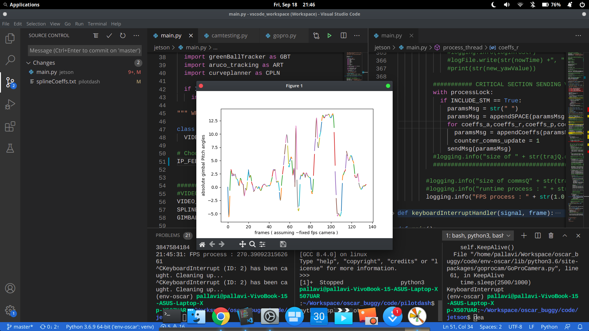
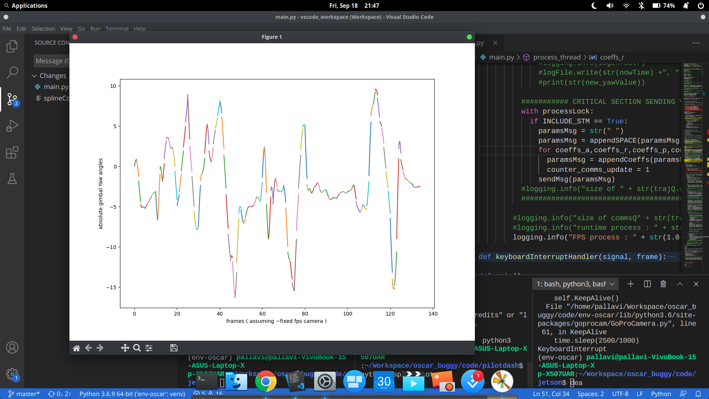
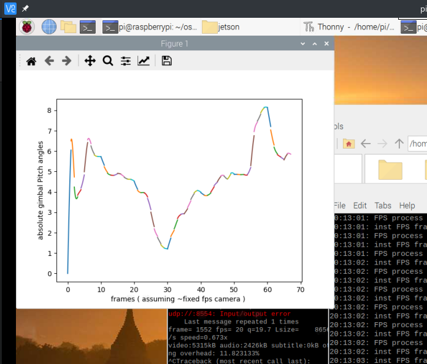
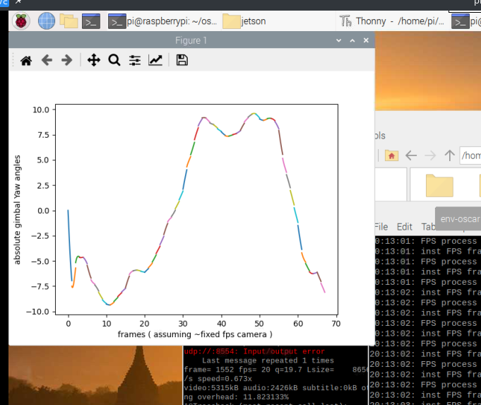
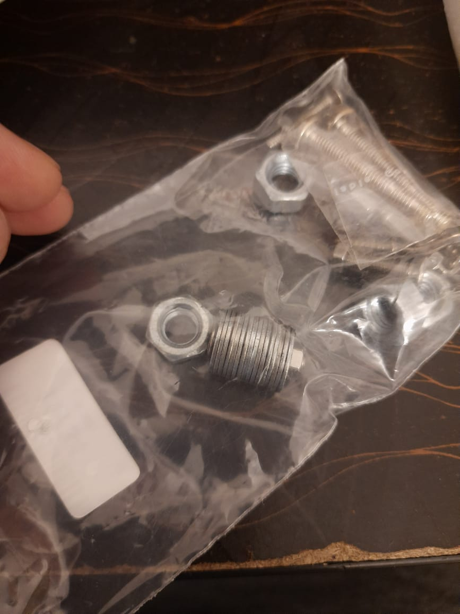
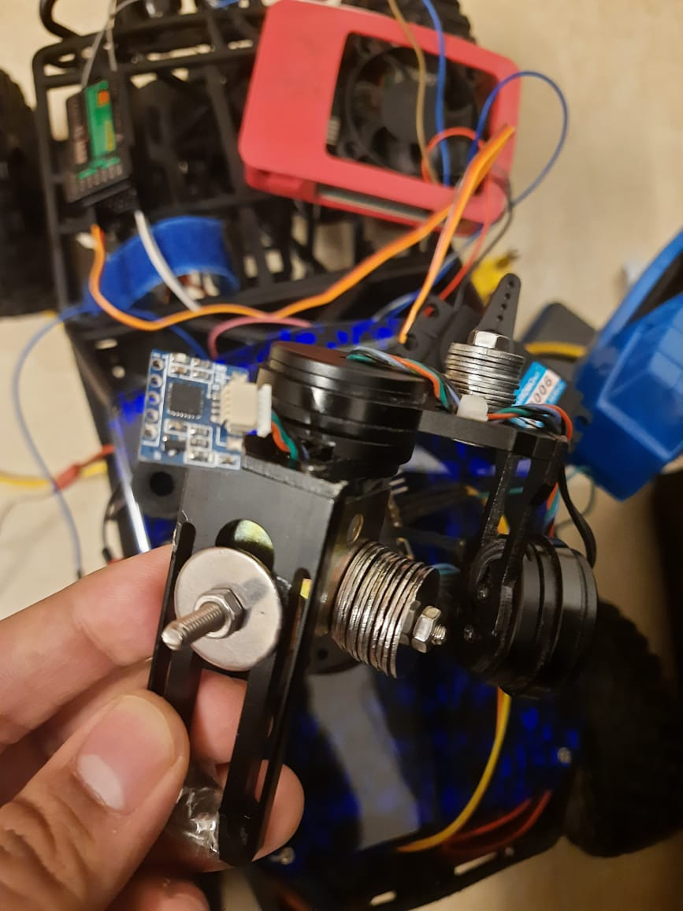
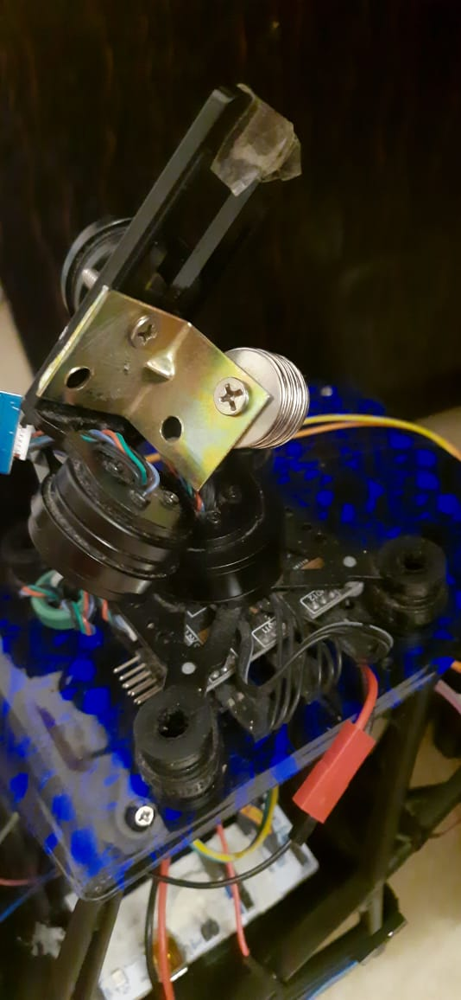

3/02/2020
Starting with GIMBAL control codes.

A good website to start with 'apart from wiki'
http://www.olliw.eu/2013/storm32bgc/

23/02/2020
Added code for gimbal controls in .ino and .py.
    
11/03/2020
9.40 PM
Resuming testing Gimbal code.

12/03/2020
8.59PM
Fixed VSCODE arduino and platformIO, installed STM32 Programmer added as a path to environment variable.
STM32 blinky blinky code works good with ARDUINO extension. PlatformIO not tested, neither willing COZ of 
MAVLINK codes ? 
Maybe I might PORT the CODES. Might !
Currently soldering UART PINS on the Storm32.

13/03/2020
5.56PM 
 
 Still busy trying to figure out MAVLINK codes ,

 Maybe the code i downloaded was firmware code for the STORM32 and not for arduino or any other microcontroller. 
 
 USed FTDI for STORM32 connected well But has version 0.90
 Latest is 2.xx Older version is no longer supported by newer oliwells GUI (Windows) 
 Will be installating older GUI, to see if I can PAN / steer GIMBAL Then move to upgrading and inverting GIMBAL with {fingers cross} newer firmware.
 Shifted to windows for ease of WORK (Sed) bcoz installation is difficult on linux.

 Found a nice design quote 
 "An important thing to look for in a gimbal is how this attachment is done. The little rubber balls commonly used for this suspension are designed to work in compression not tension. What that means is that the gimbal should hang on the balls not from them."
 ie The gimbal used in this project *should* be inverted. For better vibration cancelling response.
 src https://www.rcgroups.com/forums/showthread.php?2818200-Gimbals-101

14/03/20
8.10 PM

Gimbal Scripts STORM32
For understanding the internal working one should realize, that the STorM32 controller code is essentially an endless loop, which is triggered and repeated every 1.5 ms.
src http://www.olliw.eu/storm32bgc-wiki/STorM32_Scripts

MAVLink_Communication
The baudrate of the selected serial port is determined by the respective baudrate parameter in the [GUI:Expert] tab. Per default it is 115200 bps. It is recommended to use a baudrate of 230400 bps, if possible.
src http://www.olliw.eu/storm32bgc-wiki/MAVLink_Communication

Later I will need to do pass through mavlink tunneling ie 
Accessing the gimbalGUI connection to GUI **through** a MCU/(or a autopilot etc..) coz GIMBAL is clamped DOWN to the SYSTEM (DRONE ETC.)

16/03/20
12.48PM 

Tested motion control via GUI now moving to STM32 CODE simple UART MAVLINK SWEEP CODE.

2.20 PM 
Trying D2 and D8 as first attempt for STM32 UART via arduino.
Now in elementary, Arduino / maple leaf leaflabs resources really suck at telling which port is port 2 and which port is port 3 and their respective pins.
Had to dig deep into platformio core to see the definitions now trying to test them.

5.17 PM 
Finally. 
Managed to fix the 2 uart ISSUE, NOW can communicate via two UARTS. 
Also the GIMBAL code compiled using platformIO.

11.58PM
Managed to control gimbal (hanging) from STM32 using MAVLINK codes.
Will move to inverting and FINE tuning after I get a hold of GOPRO camera.

3/04/20
3.23PM

Managed to invert the gimbal successfully , couldn't upgrade the FIRMWARE, still the firmware is V.90.

14/04/20 
4.11 PM
now moving to get the director module path, extracting from perl gimbal Scripts.
4.27 PM
S1 ) The test director profile 
The simplest director profile called test_case_around_the_world. The buggy wil complete one rotation around the football with radius such that area of the bounding box is constant.

S2 ) Getting the bounding boxes.
I will be tinkering with tensorflow today, once satisfied with familiarity move to getting bboxes.
 
22/04/20
7.01 PM 

Finished running of tracking a green ball opencv. from  https://www.pyimagesearch.com/2015/09/14/ball-tracking-with-opencv/
Finished communication between, python and STM32.
Tried to communicate via python and platformIO, couldn't communicate as platformIO also uses python at the backend.
Tried to communicate via cuteCom hyperterminal, couldn't communicate both simulatenously, sent GARBAGE VALUE on the port /dev/ttyACM0 (ie stm32 port). (YES rechecked the baudrate)
Used the port '/dev/ttyUSB0', interrupted the python terminal and could see the op on the hyperterminal.

23/04/20
8.01 PM 

Wrote bash scripts to create cpp and header file pairs.

25/04/20
1.25 PM 
Starting for obj tracking on Gimbal added robo_thoghts_code_linkedIn in references, continuing with green ball detection.

1.44 PM 
I will be needing to write bash scripts for python as well.

5.37 PM 
Managed to get to and fro comms for string data types.
Now moving to other types. https://python-forum.io/Thread-Writing-commands-to-serial
See dead Eye's Comment in this link.

10.11 PM 
Wrote cleaner versions of the UART codes for STM testing again the clean versions.

11.12 PM 
Done with send_until_ack and rec_and_ack on the MCU side. NOW NEED TO DO THE SAME FOR OBCOMP side. 


26/04/20
9.06 PM
Finished today with ONBOARD pc python clean codes.
Fixed camera and gimbal hardware setup.

Now moving to PID for object tracking via GIMBAL.

27/04/20
1.15 PM 

Some fucked up shit ..., need to convert from String types to getiing float via csv vals from Strings ( Note S is capital). ( Arduino fucked up libs.)

2.25 AM 
Theres isnt as much shit in this world wrong as there is wrong with arduino motherfucking Strings.
Still unresolved issue of unable to  convert it to plain strings and parse the motherfucking data.
shitty ARDUINO. Sadly need to rely for the bloody mavlink APIS.

2.51 AM 
Did a bloody brute force and copied String to string char by char and then parsed that string.

Now to the ugly PID for camera angles. but Finally getiing somewhere close ? 

10.57 AM
Moving to actual feedback and gimbal control.

1.01PM 
successfully sent area,cx, cy from ball_tracking to stm.

5.27 PM 
The python version to control gimbal was right under my nose, wonder why did I insist on sending from obcomp to mcu to gimbal.
Im sending directly from obcomp to gimbal.  TOO EASY ... :) 

For the moment I have kept the MCU aside, will be using it when I would be needing buggy controls part.

28/04/20

2.23 PM 

couldnt communicate with python and gimbal yesterday, UART errors, rechecked the wirings , changed the USB wires still no luck. 
Will try the same thing today, If fails / also need to move to MCU cause python is way too SLOW ...... :(

Unable to try on elementary, hoping to see if this works on windows !

6.16 PM
Came back on elementary.
Turns out there were big loose connections on the UART pins soldered on STM. Soldered header / jumper cables to the uart pins of gimbal.
Now everything seems to work good.
Both Python and MCU.

Will now be testing cam and pixels per degree of the Gimbal, maybe /may not be useful for object tracking.

Gimbal moved webcam opened, need to tweak the python code..

9.19 PM
Ran on a python script.
Although takes too long to change gimbal angles not possible for real time.
Will be moving to stm and see if it is good enough for real time. 
Found that del_pixels/deg = 18 pix\deg (+-) 1.5pix/deg # CALC around (+-) 1 deg 
Let me try to use around, +- 3 pixels in actual scenarios ? To be tested.


9.44 PM 
Just calculating the timing reqs, takes around 1.4ms (calc) for complete UART betn obcomp and stm32.

-----------------------
NOTE 
leave 5 pins from rightmost pins col the 6th pin is orange Wire ie connected to TX of gimbal or RX of mcu.
Yellow wire 7pin below orange RX of Gimbals and TX of MCU 
-----------------------

29/04/20 

3.53 PM 
Re Soldered gimbal, uart still had loose connections not on the pins but rather on the base of the pins.
Shaky output / improper tracking. Of the final run.
Seems frame pixels are different than what opencv outputs for object center.
Opencv cv outputs x,y for object center which means my 18pix/deg assumption needs to be redefined as 18 x,y coords per degree of the camera.
I dont know as of now what is x,y and where did it come from or its relation but for the time being i can safely send x,y, which i was considering pixels.

PS frame ht and frame wd is being sent in pixels, ie 480x640
x,y vals for the current scenario is 600,800


Now retesting the final run with frameht,framewd being sent as 600,800.

8.17 PM 
Trying different combinations, at t=0 delay goes too fast, ie unstable the angle.
At t=50ms delay overshoots.

At t= 250ms delay not real time video ,and hangs the video frame from opencv.
Trying t=75ms delay.

PS also hangs after some time usual cases mostly may be caused by use of stupid (S cap)Strings.

Still the motion of the camera is too fuzzy, at delay=75ms in orient gimbal function. too, Also I have way too many false positives. And the script hangs after some time, I dont know most likely due to while loops inside UART.
I will be needing to write a more reliabler system. This while 1 sysstem is too unreliable, also debugging not working with simultaneous UART running.

I am keeping this aside for now, will be back after some consultaion and making of a better operating system TTH hopefully.


30/04/20

10.00 PM
I am Currently sending back free memory usage, through uart back to pc
ie in while loop in python sending object coords and receiving freeMem from MCU. 

Trying to debug why does it stop working now after 10secs, seems memory WAS NOT THE ISSUE AFTER ALL.
The free memory seems to be constant, for whatever small number of iters my codde runs before it hangs out.
Most likely it gets struck in the while loops created for sending and receiving, Acknowledging messages. 

Solution: Dont us the while 1 loop architecture, start using TICK based TTH architecture. 
Also I should switch to using STM CUBE IDE to use ITM for MCU debugging instead of ancient printf. OR find a way to get working ITM in PLATFORMIO.

2/05/2020
1.01 PM

Working on the interrupt based uart.

4/05/2020

4.17 PM
Working on the new architecture, uart resolved,now calculating gimbal timings.
Also it takes around 10 MS to run the process part of OpenCV so WE can do 60fps grab, which is aroud 17MS time.
So currently my process is 10MS and grab is 17MS thus feasible and stable., in python module.


5/05/2020
10.57 AM
Resuming gimbal control and finding min time between each commnad sent and received(if possible).
Also added magnets as a counter balance for gimbal for better stabilization.

Seems yesterday the gimbal was behaving crazy headless chicken cause there was instability, now that magnets have been added its working pretty smooth.
I found the following values. 
Writing 1 angle to the gimbal takes around average 3.7ms, ie between 3ms and 4ms.
Assuming wcase 4MS per writing angle, reading angle not working maybe need to tweak the firmware.
Later..

11.21 AM 
Moving to python code and getting processing / threading / trajectory generation.


6/05/2020

10.13 AM

Resuming multithreading for python.

8.55 PM 
Found this statement if cv2.waitKey(10) == ord("q"):
      break
    is necessary for showing the image.
Dummy thread along with grabber thread managed to get working together, 
now moving to get the actual process thread running.

10.32 PM 
Done with the actual green ball threading.
Now moving to trajectory generation.

11.55 PM 
Done with linear trajectory generation.
Testing of comms and big picture, remaining.

7/05/2020

8.19 AM 
Set the wait key to 5, FPS bounced back to 30.

10.22 AM
Done with comms writing code.

8.51 PM
Cant get all three threads working at expected speeds.
If comms thread is used, fps proces < fps grab.
else  fps proces >> fps grab.

8/05/2020

12.19PM 
Managed to get threads balanced with successfully sending data to stm32, now writing the gimbal maths part.

3.51 PM 
Managed to get everything working.
Now need to tweak the obj detection part. To a football.
Coarse tuning needed.

9/05/2020

12.26 AM 
Discussed the new architecture, will continue tommorw. 

13/05/2020

7.03 PM

Looked into the spline codes, decided to generate splines in cpp instead of python and sending the coeffs,
coz python doesnt just give coeff it gives coeff for a set of vals. and params , 
so the spline can only be recreatd with python functions with python coeffs.

So i will be sending obj params data pts every 300ms or some specific pts.

In short. 
Frame extraction and processing on the obcomp.
Traj generation on the mcu aka sticking to the first architecture with few mods.

1.Need to test Bspline on playground.
2.Also need to test Bspline function and read up on how to use it from http://ncar.github.io/bspline/classBSplineBase.html

14/05/2020

9.03 PM 

Failed efforts at trying to get the lib running, switching to diff library.
copied the 1st. custom defined lib from https://stackoverflow.com/questions/1204553/are-there-any-good-libraries-for-solving-cubic-splines-in-c

15/05/2020

8.16 AM
The custom lib gives erroneous/discontinous graphs results https://stackoverflow.com/questions/1204553/are-there-any-good-libraries-for-solving-cubic-splines-in-c
Moving back to figuring out using http://ncar.github.io/bspline/classBSplineBase.html

1.06 PM 
Tested splines creation for the pipeline .. tested 6 vals 3 being updated each time and spline exec starting from 50% coz last 50% was already exec in the last run ..
Trying to move to 9 vals spline for better smooth curves. and 3 vals dropped each time ?
Nahh sticking to 6pts 3pts io each time ... TESTING THE CODE ON PLATFORM IO.

2.52 PM 
Trying to add boost to platformIO. Taking way too time added via github.

16/05/2020

12.56 PM

Trying to install Boost on platform IO doesnt work at all. Wrote a issue on the forum 
https://community.platformio.org/t/boost-cpp-lib-installation-cannot-open-boost-config-hpp-works-on-g/13723
hopefully someone helps ,
The program is taking way too much time to complile about 466 Seconds .... So i am creating a dummy project to see if i can simply get boost libs included .. 
lib.json extraced from .. 
https://github.com/cr1st1p/platformio-boost

Added one more qs on stackOverflow
https://stackoverflow.com/questions/61834439/issues-installing-boost-on-platformio.

9.21 PM 
For now completing the remaining part ie getting params from obcomp to arduino, 300ms at a time. 

Reading up on semaphores and mutexes from https://www.justsoftwaresolutions.co.uk/threading/locks-mutexes-semaphores.html
Also will be writing notes here so may ignore a few paras.. 

Read up on this /\
                |

Also added UNTRACKED_NOTES files .. the reason why there isnt a long notes para here ... 

10.20 PM
As decided in the lastest design I dont need to have 3 threads , I will be sending vals in the process thread which is called every 300 ms or 10frames in the imgQ bufffer, and sending the coords simply from the processor aka IMG coords area, ObjcenterX, ObjcenterY.

20/05/2020

10.06 PM
No help from stackOverflow and PlatformIO forum , so for now I will be keeping the splines part aside wait for few more days else lookup a new library compatible for generating splines for embedded environments.
I will now be continuing with the Old design with alrternate or every third frame processing.

Also I need to lookup to write better CAPTAINS LOG FILES with proper keywords and all.

For now I am listing and explaining MAJOR MILESTONES and FAILURE PTS as FAILURE_POINTx. as per my memory.

FAILURE_POINT#1
Managed to get headless chikened gimbal followed by oversampled gimbal using while(1) both obcomp and stm32.
Sending object params to MCU, MCU does linear traj generation.

FAILURE_POINT#2
SLOW/UNDERSAMPLED gimbal movement with threads running obcomp and tick 10ms continous frame processing.
Trapeziod traj generation on OBCOMP sent every ? sec send to MCU and wait for ack by MCU every 10MS. ie all MCU does is control gimbal.

FAILURE_POINT#3 (current)

Removing comms thread from FAILURE_POINT#2 on OBCOMP, with the trapeziod trajectory gen on MCU by sending obj coords as done in FAILURE_POINT#1

Qs how do i sync with MCU ? W/o Acks ?

What if i dont send acks ?
If i dont send acks then OBCOMP may act as babbling Idiot and keep sending traj coords at an extremely high rate ? Or a rate depending upon (fps/3) ( ie a 3rd frame every 300ms)
aka Wont be a issue put it in the pipeline.

10.56 PM 
Starting with removing comms thread from main.py.
2. Processing and sending every third frame params.
3. trap traj gen on MCU followed by splines generation.

21/05/20

12.19 AM 
Done with removing from main.py and adding sendParams yet to be tested.
Moving to trapeziod traj generation on cpp.

1.00 AM 
I found a beauuutiful book for trajectory generation.
https://books.google.co.in/books?id=FiX1ceRT5zoC&pg=PR10&lpg=PR10&dq=trapezoidal+trajectory+cpp&source=bl&ots=KT877eTx4S&sig=ACfU3U35ceOVZ5l_Uv_xEPo_HqejJdg9zw&hl=en&sa=X&ved=2ahUKEwiPyK6gkcPpAhV67HMBHe78ATYQ6AEwB3oECAsQAQ#v=onepage&q=trapezoidal%20trajectory%20cpp&f=false
see eqns on pg 19 and 20 for acc,vel,dist a,b ie from 0 to flex pt and to destn pt.

1.35 AM 
Stumbled on something beauty found cpp src codes of matlab for splines, also adding the above link ebook in references.
Adding src codes first in playground then in the main project.

9/06/2020
9.13 PM
Resetting the setup at new place, will be trying the above mentioned matlab spine codes. Later ... ish.

12/06/2020 
12.47 AM
Writing a cleaner readme on what are my exact connections....

2.32 AM 
Wrote a nicer readme...whew. 

12.58 PM
continuing setup ... 
3.05 PM
Setup complete


11.32 PM 
The setup works tracking NOT maybe I have disabled tracking,
Things I need to do. 

1. Get done with proper spline and tracking.. 
Using MATLAB.hpp files ? Let me see. 
s1. Enable TRACKING code.. See if board flashes or not .. 
s2. Observe 
s3. Improvise
s4. Repeat .... 
 

Saw above FailPoint 3 will be continuing from there. 
OpenOCD failure as expected 
What all didnt work 
https://stackoverflow.com/questions/41066653/openocd-error-libusb-open-failed-with-libusb-error-not-supported
Renamed to 99 to 60 / rebooted each time copied directly 
Also copied from lsusb
Used sudo udevadm control --reload
Made 

Finally found a useful link 
They say good artist copies great artist steals , had been blindly dumping This code from here and there wasted ~3 hrs doing and testing variations.
https://andreasrohner.at/posts/Electronics/How-to-fix-device-permissions-for-the-USBasp-programmer/

I somehow knew the issue was with sudo in Manjaro. but didnt exactly knew what to do chmod a+rwx whichfile .
Now a bit more clearer. Also why Arch ): so difficult ?

This simply clarified what was to be done ... ( I have only tested the quick and dirty version and also havent yet flashed MCU, but got rid of libusb error, now only hardware issue I think.)
Nor have i made the rule file. 

1.46 AM 
Signing off until today . Wiedersehen 


15/06/2020
9.55 PM 
Testing 

10.30 PM 
Finally was able to flash on Manjaro automatically ( with that script ) writing in README

11.40 PM 
Finally full setup complete. 

Now moving to gimbal tracking via spline curves with object params being sent to gimbal.
I dont have the old os playground hence dont havre that matlab spline file SED. 
Next time limit everything to same folder ... 

16/06/2020
10.13 AM 

Splines testing cont ... 
Cant use matab src codes coz they need the Seconds and third derivatives of the curve which I DONT KNOW. 
Summary 
Failed like shit implementing and trying to find spline codes for embedded hardware 
following thigs I have tried : 
1. Boost Codes. ( isnt compatible with platformIO) ( see https://stackoverflow.com/questions/61834439/issues-installing-boost-on-platformio )
2. Individual Codes. ( Way inconsistent for a spline )
3. Lots of libs mostly inconsistent. ( Lost track )

Back to first approach 
Send spline coeffs to mcu from python 
issue 
inconsistent no of pts for spline curves and unable to recreate spline with the coeffs.

Second issue way less ugly to solve as compared to the first 1 , so proceeding with that. ie first approach.

1.44 PM 
Found a way to calc splines and get the coeffs for the piecewise curves. 
Also Miracle happened the spline code in main.py ran and compiled the first time .

9.12 PM 
Moving to integrating spline codes for MCU.

17/06/2020
1.31 PM 
Miracle again cpp codecompiled in the first time, done getting / parsing coeffs now testing gimbal math. 

2.54 PM 
testing started Frames MAXED OUT 10 frames. with stm True.
FPS at 10

4.57 PM 
Few bug fixes on the python side yet to finish all. 

6.22 PM 
Found that you can't send a lot of chars via uart bug , don't know how many before code crashes but crashes when sending 3 x4 Coeffs 
Maybe Speed it may send all values but it would also slow down the speed so much that it crashes ie my FPS process falls below FPS Grab 

Possible solns

1. Increase speed. 
2. Reduce on the size increase on the frequency. 

Trying option 1 
Increased baudrate to 921600 buads / Still process loop freezes
Possible issues 
1. MCU cant handle such a long message 
2. Process isnt being slowed down coz thats pretty Fast Baudrate 
So mostly I dont know what error ? 

Solution 
Send One pair of coeffs at a time. 
reprogramme all the stuff. 

7.14 PM 
fuck me, I didnt typecast that comms message to str before. 
In the sending 12 parametrs message. 
|Thats why maybe it didnt work, now I have edited too much for sending only 1 paramter at a time. 
Need to read up on versioning schemes and start workig upon it 
Coz this is way too headache despite git logs goinf back and forth writing same pieces of code with little changes ... 

Nonetheless sending 1 curve at a time is much better than sending 3 and Calibrating them. ( which I already wrote .. No issues Thats how progress happens failure after falire and testing stuff in the real world)
Also remembered why the hell did i cal it a Miracle in the Above times for python 

While using threads python interpreter does not give error output 
rather doesnt run the thread .. .
Ha Ha me .. 
Anyways will be taking a break now Continue later tommorw been working for around 8-10 hrs more or less. 
Wiedersehen, Sayonara, whatever the shit lang u speak , .. Goodbye .

10.25 PM 
Hey Im back .. 
Working back on main.py
Probably a shitty programmer of the world me... The issue was i was indexing coeffecient 4 as 4 which is at index 3.

18/06/2020

2.04 PM 

Writing code for 
1. Getting last message time.
2. Distributing the time or scaling the time.

3.23 PM 
Have written the single spline codes, will now be testing  and debugging this btw both stable 

11.05 PM 

Stm 32 Timer's not working properly .... 
Now what ? 

Possible options 
1. Fix it 
2. Run away to using RTOS, ( more shittier setup and more headache + need to port the entire code)

Who AM  I kidding 
Go with option 1 
Will be trying to fix this hardware interrupt issue. . .. 

Let us see. Headache nonethe less 

19/06/2020 

2.27 PM 
 
Starting with the yesterdays debug .. 

Found the source for Hardware Timer interrupt ISR API at https://github.com/stm32duino/STM32Examples/blob/master/examples/Peripherals/HardwareTimer/Timebase_callback/Timebase_callback.ino

Cleaing things a bit in main.cpp

3.58 PM 
Leaving interrupts behind used the same code as in documentations. 
For now continuing with main loop . 
Maybe the API support has been removed( seems so ), or what I dont know ? 

I tried the following things 
1. Made a separate file pair for tweaked ISR ( coz original has bugs )  no response
2. Copy paste code from github ( above link ) in main.cpp with including header files . 
3. Tried from another source .. Didnt work too much incompatible 
4. Tried previous commits code where this worked , Didn't work now . 
Another reference 
http://docs.leaflabs.com/static.leaflabs.com/pub/leaflabs/maple-docs/latest/lang/api/hardwaretimer.html


4.50 PM 

No luck tried various oterations , will try again tomorrow .

22/06/2020 
8.33 PM 

retrying timer on a separate project.
Failed there too 
Surely about some failed dependence issue of Arduino 
NOW I AM INSTALLING MBED OS6 will try the code via MBED APIS 
Meanwhile it is getting downloaded hopefully runs on arch saw the bash file supported only 16 and 18 Ubuntu versions 

I ran the blinky blinky code on MBED_studio 
clangd isnt available for this bleeding edge as given on website 
Trying a little forum magic else 
Straight from AUR ( God help ME )

I wont ever use Arduino for the projects I promise ( only for quick and dirty things like pwm signal shit ) Please let the porting be easy .. Please 

23/06/2020
10.42 AM 

MBED Studio installed however wont be using it , stupidity to port all codes , I'd rather than go to using RTOS

I am doing way too shit just to get the timer Interrupt running, Instead putting a 10MS if statement in main loop. 

24/06/2020

9.30 PM 

Compiled and running. 
Gives wrong output, 
Observations 
1. Pich always 0.
2. total yaw overflow
3. Integrated yaw indefinitely 

Right now for the sake of visualizing Im looking for plotting live MATPLOTLIB to see If I am sending correct angles.

30/06/2020
10.13 AM 
Resuming work for matplotlib live plotting 

10.39 PM 
Failed to integrate matplot lib thread to print stuff parallely 
Tried following things 
animation matplot lib ( see MatplotLibLive in playground and subsequent histories)
Tried canvas flush 
Tried integration with Tkinter ( tkinter  has it all new set of problems hence dropped it )
Tried simple integration canvas flush as a separate thread and tried in the same process thread 
Fails in separate thread doesnt pop up 
In process thread works as a single thread hence doesn't let opencv display until the plot stuff is completed 
will retry with same in gui thread 

Works but doesnt , thread balancing issues , wait for 300ms in gui thread still lag for FPS prcoess 
|Still fails at 500ms sleep 
Images keep on piling 

Going back to primitive life 
Will be using log statements to debug my mcu status ALAS 


11.36 PM 
Fuck me like really fuck me 
Theproblem itself begins at src , the algo isnt giving me correct values for object cx,cy  , now what the fuk 
Rewrite this >>>> ? 
No wonder why they ask for proper test cases DAMN 
*sobs in corner*
Do the unit testing damn it 
Write proper test cases 
Now writing test cases for my algo function first. 

11.48 PM 
Stupid me I had been running the code entire time for blue colorsa on tennis balls 
Now it works with green color 

Still I will be writing test cases once i get the gimbal running well.
Now trying to RUN without WALKING again with the entire setup ? Maybe not No IRON MAN stuff doesnt work that way ..

11.59 PM 
If object isnt detected The delta angles are 12,16 degs 
Ingenoius actually 
(FRAME_CX - objCX)/(PIX_PER_DEG+PIX_PER_DEG_VAR)
This is the formula to convert pix to degs 
so if no objs available its pos should be frame cx and cy and not -1,-1 

12.13 AM 
Fixed atleast 50 % stuff is working in python moving to embedded and real life 

1.16 AM 
The following things are wrong 
1.calc value here is half on MCU side 
2.pitch doesnt work
3.Oveflow for total yaw values 
4.Inst yaw struck at 42/-42 wil debug this today later 

1/7/2020
11.51 AM 
Continuing Debugging 

2.45 PM 
The values integrate to +- MAX Value set 
Need to regularize the ouput feed

Also need to do versioning 
But that to be done later 

3.07 PM 
Increased the interval 50MS no effect, keeping it back to 10MS .... ? 
NEed to visualize th stuff 
 
Doing this after a break.
Plotting del yaw angs and total yaw angs 
After plotting it seems there are many outliers will be using MAD filter to filter out outliers and spikes  

3/07/2020
4.55 PM 

Read upon semVer versioning , implementations starting with 

1. EXplicitly defining my API 
Software using Semantic Versioning MUST declare a public API. This API could be declared in the code itself or exist strictly in documentation. However it is done, it SHOULD be precise and comprehensive.

2. Starting with 0.0.0 version after all APIs have been declared until that I cannot proceed. 

4/07/2020

Making sure where i go wrong before i go right ie getting good data and visualization. see plottingFromFile.py in /vision.

9.23 PM 
Did integrate video file option in main.py , getting 6 feeds in log file raw,filtered,curves and having some issues in integrating MAD filter to the main code. 

5/07/2020
11.32 PM 
Done integrating filtered vaules and getting log file , now plotting and analysis. 

1.17 PM 
Will be trying to delay the integration more, done testing ....

9.03 PM 
Delaying time for integration ? GEtting values passed to Gimbal,

6.07.2020

2.15 PM 
Tried lots of attempts to give it a cinematographic calibration in a spline fashion, failed , waiting for advice .. 
Till then beginning with buggy .
01. Making the block diagram of the current status .
Heres how i plan to proceed, 
1. getting area from vision algo 
2. Getting the hardware buggy. 
3. Starting with trajectory generations ... ? 

3.15 PM 
Made a brief paint workflow in /presentations ..

7.7.2020

4.18 PM 

1. Starting with aruco/getting area of the object instead of the regular green ball , cause its much easier 
Found a project with more or less http://jevois.org/moddoc/DemoArUco/modinfo.html cheaper version of what im doing ... 

8.7.20 

4.00 PM 
Added aruco files in playground, now printing it and writing subsequent code for area, cx and cy.
4.51 PM
Finished with the aruco getting area, cx and cy ... 
Yet to integrate in the main files 

9.7.2020 
3.00 PM
Printing and testing aruco. 

4.20 PM 
Verified working of aruco. 
Wil be doing the following things
2. Making the integration factor correct , ie making sure of the multiplication factor.
Testing this 
1. Gettting correct spline output. ie first doing visualizations of the output ... 

11.7.2020
12.05 AM 

Messed up with git logs, lost logs of 10/7/2020
Basically was fixing this shit .. which i did ? or not .. also was fixing since i changed my home dir on Manjaro


12.07 AM 
Now just moving ahead with the 2 parts of getting correct code output.. 
Founsd a nice web for showing polynomial plots python 
https://www.python-course.eu/polynomial_class_in_python.php

Im done for today , c me back on sun/monday ..

12.07.2020
2.37 PM

Continuiong ... 

4.21 PM 
Wrote code to get / plot splines according to coeffs every timesteps ie plotting piecewiase curves of my splines .
Dug deep in the history of git to get the working main working codes.
Stashed the ouput for plinting coeffs to file. 

13.07.2020 

6.30 PM

Contniuing fixing main.py 

7.27 PM 
Turns out my entire splines plot code IS wrong / Damn I didn't verify it .. okay so now verifying it, 
Piecewise curves are a no go.... 
They arent continiuous !!!!! PERIOD , so now what i will be doing is digging back into splines and things straight working ... 

8.00 PM 
Here are the takeaways ... ( for spline regenration) 
C1 Send coeffs/degree/knots to the MCU and find compatible regenration methods between python and CPP.
C2 Send just knots to MCU and let it figure out the spline / or any other curve it wishes ... 

Going with option 2 coz its much easier to manage ... also no point in regeneration in MCU and regenrating it again in jetson ... 

###END OF VERSION###
Lemme call this 0.1.x 
So the next one will be 0.0.0 alpha 

Also for the next version I will be making a markdown CAPTAINS_LOG

See you in the next version.

14.7.2020  
9.27 PM     
turns out you cant retain history even after git mv -f README.md README     
Its just equivalent of
``` 
$ mv README.md README
$ git rm README.md
$ git add README
```

15/07/2020 

2.45 PM 
So far I have been looking for spline codes for POSIX standards so even if they were to work, they wouldnt work on ardiuno.
Trying to use this library .. https://github.com/luisllamasbinaburo/Arduino-Interpolation

16.07.2020
12.50 AM 
Fuck platformIO and fuck arduino even more ... 
The codes arent working back again on STM32 , verified if the board is working using online ARM COMPILER https://ide.mbed.com/compiler/#nav:/mbed-os-example-blinky_fresh; 
Like litreally fuck both arduino environment and platform io ( why not )

Looked into working of freeRTOS, hah uses IAR embedded workbench IDE ( For windows only... paid versions for linux get a quote bs  ) 

Options 

1. Get working with unknown RTOS ... ( Looking for the first time )
1.1 Use either FreeRTOS on windows 
1.2 Use Zephyr platform IO 
1.3 PlatformIO third party FreeRTOS 
2. Port codes to get working to the ARM mbed APIS. Fuck . ( Little familiar )
3. FlexTape arduino again ... ( Very FAMILIAR ) 

PROS RTOS 
More stable , people say .
I can use standard boost stuff for spline generations etc ... a relief there whew ...    
ie POSIX compliants

CONS RTOS         
Change either my this OS ( ie move from Manjaro to Windows to using IAR limited size version )
Or use prewritten thirdParty versions for STM on PLATFORMIO
Change entire source code to9 get POSIX compliant , modules availabilitty an ISSUE
 
PROS MBED          
Familiar a bit , 
More easier to setup 
Has vscode like ide 

CONS MBED       
Not POSIX COMPLIANT 
Will need to dig SPLINE codes 

PROS FLEXTAPE        
No need to rewrite the entire project APIs. 

CONS FLEXTAPE        
May breakdown again in future ... Very unreliable experience 

What I need            
POSIX compliant spline codes (coz of bsdk floating Points ) , arduino api support (coz of madchod MAVLINK) , stability( fucku arduino) , portability ( fucku platformio) , basically everything with less effort .

They SAY its easier to make a 4feet mirror and then make a 6feet mirror than to make a 6feet mirror. 
or it takes less time """ to """ than """ . 

So going with porting codes to MBED then to RTOS ( hopefully )

FUUUUUUUUUUUUUUUUUUUUUUUUCCCCCCCCCCCCCCCCCCCCCCCCCCCCCCCCKKKKKKKKKKKKKKKKKKKKKKKKKKKKKKKKKKKKK       TTTTTTTTTTTTTTTTTTTHHHHHHHHHHHHHHHHHHHHHHHHIIIIIIIIIIIIIIIIIIIIIIIIISSSSSSSSSSSSSSSSSSSSSSsss 

1.15 AM 
Reistalling MBED IDE coz stuff breaks down in Linux , i changed my home dir to ssd 
Getting STRAIGHT FROM ARCH
Coz last time it didnt work the normal way ( it didnt work the arch way either ): )

I really dont  wish to port all the bloody CODES , porting isnt a joke 
Can I go directly to RTOS ... ?    yes , but will 

1.48 PM 
ARCH desnt work shoews arm clang not registered rmoving it and adding from officvial websirte    
The stuff was 2.8 GB i deleted it , funny it still shows up in app menu , now downloadng shit inside the semi broken mbed compiler 
2.20 AM 
Got MBED IDE running 

16.7.2020

11.37 PM 
Got splines code running for cpp 

11.43 PM 
Retrying if things work with arduino ?

Tried using debugger shows 

Dont know whats the issue.
Seeing ig things work out well in MBED ie if spline codes work there.

19.07.2020 
 
12.33 AM  ___
Spent 6 hrs yesterday and 3hrs today tring to get *professional* in this embedded world, 
simply trying to get the led blinking the *professional* way using bareMetal I think. 

Found a old dated blog to setup eclipse and use RTOS on it,  see this https://www.carminenoviello.com/2014/12/28/setting-gcceclipse-toolchain-stm32nucleo-part-1/
This is justg the setup part. 

Failed like shit yesterday, tried 2 Operating systems this manjaro and shitty windows      
Today 
Was struck on how to flash via stlink, i was searching for a GUI like shown in windows there, however found a command line interface ( noob me ) for the linux version 
Shown by this 
https://amitesh-singh.github.io/stm32/2017/04/09/setting-stm32-dev-environment-arch-linux.html


The amount of different things and commands I have tried to just get the board flashing is beyond the scope and remebering and a complete chaos, If i were to replicate it it would be fully impossible, I dont think i will bw able to write a GoodEnough Readme for this setup, GOD help someone who will do this setup, you are on your own. 

Still the LED isnt exactly blinking, but I **do** have flashed the file 
using this 
```
st-flash write -V1 /home/zero/eclipse-workspace/blinkyretry/Debug/blinkyretry.hex 0x08000000
```

Hopefully this is a correct approach, lemme see bis balt, Tssüchs . 

9.30 PM   
___

Continued this [blog](https://www.carminenoviello.com/2015/06/22/running-freertos-stm32nucleo-free-gcceclipse-toolchain/)

Spent 4 hrs still trying to figure things out , and how stuff works (still a lot unclear ) 
Managed to glow the led based on this [repo's](https://github.com/cnoviello/stm32-nucleof4) code compiled on eclipse.       

Flashed the led using this [help](https://stackoverflow.com/questions/37644823/how-to-flash-stm32-using-only-linux-terminal)

Wrote a bash script to run those commands, works wierdly still testing stuff..     
In general Stuff is difficult , just getting the led to blink seems impossible ( spent over 15 hrs now ) , do i really need to upgrade/port to RTOS.


21/07/2020 

9.10 PM 

Wrote a working bash script to flash the STM32 properly from .elf files, now adding the project, 
Now On I will be parallery working on RTOS and will be fixing spline codes on bloody ARUDINO 

Resuming proper spline testing for ARDUINO for the 4 th time IG, have lost the count, hopefully the above used cpp code works.

10.58 PM    

Theres some issues in platform IO i guess, installing plain ol arduino IDE to see if things work out well 

Found a nice thing online [freeRTOS arduino implementations](https://create.arduino.cc/projecthub/feilipu/using-freertos-semaphores-in-arduino-ide-b3cd6c?ref=similar&ref_id=105093&offset=3)

12.28 AM     

As mentioned earlier, arduino is fucked even with the official ide, a lot of incompatible changes are needed to be done to get the code running . 

2.23 AM 
Not A Joke this RTOS thing, it takes around a page full of code just to send or recieve chars .... 

Fixing flex tape arduino best , 
Porting to MBED apis , 2nd best
using RTOS no best

issue platformio doesnt seem to upload the code to the  board well 

possible solns tried 
1. Use RTOS ( not building a rocket, dont need )
2. Port to MBED , rewrite all the stuff ( havent tried  )
3. Flex tape platform IO ie try led code ( didnt work i think )
4. use another OS ( ie windows for platform io )
5. port to fit the native arduino ( ie downgrade )

Also A little FEEDBACK to myself 

I do need to improve and include these things in these NOTES with proper keywords for finding things easily 

the file(s) location that i have tried and the commit message or ID
Keywords for tried planned debug , issue, and NOTEfor imp things


6.15 PM 

Been thinking how to proceed for the past 4 hrs and setting up stuff 
Platform IO is shit tried the following things on platform io 
1. blinky code arduino 
2. blinky code mbed
3. windows both versions 
Just doesnt work 
tried luck with freeRTOS, way too ugly to configure ....
Looked into zephyr platform IO , also way vauge for me at the moment , didnt find much easier 
Came to using MBED , the ide is having some issues the cpp linter doesnt work, on manjaro insdtalled everything on windows 

Now finally PORTING all the codes to fit MBED apis         

Heres a list of all the files I need to edit        

gimbalstuff.cpp       
main.cpp        
uart.cpp         

29.07.2020 

9.20 PM 
I have ordered a new STM nucleo board as a backup, 
Juggling on Windows betn VSCODE and MBED srudio, 
Starting porting of CODES . 

Starting with 1 . 
uart.cpp
then gimbal then main 

11 pm 

Partially ported wrote gimbal and uart 

30.7.2020      
10.47 PM       
Seems some compiler bugs in mbed c/cpp compatibily  
[ERROR] Warning: L3912W: Option 'legacyalign' is deprecated.     

3/8/2020 
12.35 AM 

Ported compilable code for MBED , had a discussion was asked to use baremetal , above my paygrade honesstly .. 

Continuing debugging on mbed doesnt show any outputs ps this is the [current main file](code/stm_mbed/main.cpp)

4.8.2020 
1.57 AM 

Found that only one Buffered serial works on MBED code 
ie if I use multiple Serial ports the code just doesnt run 
On MCU gives no errors on compiler ,  [current main file](code/mbed_testing/main.cpp) Commit : uart debugcon . 


2.58 PM 

Yeah the same issue as above, cant use multiple uarts on this 

4.37 PM 

Added MIT License 

11.11 PM 
 Blinky code baremetal added 


6.8.2020      
12.25 AM          

Today I did v 0.2.0 for baremetal ie blinky code and UART TX


6.8.2020 

12.45 PM 
finisheed v0.3.0 ie receiving Chars through interrupts. 

Now testing the feasability of splines 

7.8.2020 
6.10 PM 
Regenrated splines using coeffs see files 
splineplot.py splinetest.py splineCoeffs.txt see . 


7.42 PM 
The previous really fucked up output btw :) ( *picture that laughing emoji here* )


Whats happening here ?     
Each **F** is a curve for each set of splines that are being sent to the MCU ( the update 1 pt keep 5 pt buffer , turns out the splines that way arent continious. Let me see if things work out different using this properer piecewise coeffs provided in [this curveplanner file](jetson/curveplanner.py) )

In this file I am doing a little different things , erm ...  a diffferent python function to get the splines lemme see if things are continious if any .. if not adjust first and last values maybe .. ?


1.06 AM      
So heres the following scenario      
the piecewise curves are not continious 

The Piecewise splines are gotten from this [link](https://stackoverflow.com/questions/13384859/coefficients-of-spline-interpolation-in-scipy)

More particularly this [imgcode](sshots/stackoverflowSplines.png)

Turns out that code is deprecated hence I went to undeprecate it and came to the following code in code/jetson/curveplanner.py

Now during this codes unittesting I gave a set of sample vals shown in green in the graph , and was happy to get the pieceeise splines but they arent continious .

So now I am left With the Following things 
Assuming that my piewise splines are correct and are always this fucked up    . 
I can go ahead and use the tck or spline parameters from [here](https://docs.scipy.org/doc/scipy/reference/generated/scipy.interpolate.splrep.html#scipy.interpolate.splrep)

**SideNote**
TCK stands for T - knots ( points through which splines passes )
C - coeffs ( these are 1 coeffs per knot )
K - degree of the curve in question. 
What basically i was doing is converting these tck vals using some other python lib into piecewise splines. 
**SideNoteEnd**

And decode those params using [this](https://docs.scipy.org/doc/scipy/reference/generated/scipy.interpolate.splev.html#scipy.interpolate.splev)

ie make / regen spline from this python lib ( but this is depreacated ) which brings me 

to regenrate splines by using this [method](https://docs.scipy.org/doc/scipy/reference/generated/scipy.interpolate.BSpline.html#scipy.interpolate.BSpline)

This tells the exact relation of tck vals of a spline to an output val of x in mathematcal terms. 
 ie 
 for reference these are the values ... in this 

 This is the clean way of how python makes smooth curves ... 

The ISSUE / OPTIONS 

1. See the above code and try to rewrite the bsplines maths or search online cpp versions of this above maths ... ( was not recommended earlier )   
2. go ahead with the piecewise splines for this much varying / variability 
3. Let the  math part be done by some c lib and rather send direct cx,cy, area to the MCU and let it ( the library) interpolate the points for me ( done already above (readup). ). 

8.8.2020  
11.24 AM  

Plotting the Bspline curve along with peicewise curve here 

EDIT : Found a nice claener way of implementing Bsplines on the [scipy website itself](https://docs.scipy.org/doc/scipy/reference/generated/scipy.interpolate.BSpline.html#scipy.interpolate.BSpline) 
see this 

12.16 PM 

Heres the 

I have regen the Bspline curves usign the same tck data as for the piecewise curves , it has its own way of implementing stuff yeah its based on general maths and may/should follow the convention , ie it follows the formulas listed above in the docx. 

They have given a simple math implementation if I were to do it in CPP.   But the assumption that knots are passing pts seems to be gone NULL and VOID heres the snippent from spline plot which is plotiing the stuff 

```
  y2 = [0, 3, 1, 2, 3, 5, 8, 13, 17, 24]
  x2 = np.linspace(0, 1, 10)

  y3 = [1,7,3,4,10,2]
  x3 = list(range(1,7))
  tck = splrep(x2, y2)
  print( " len of knots is " + str(len(tck[0])))
  print( " len of coeffs is " + str(len(tck[1])))
  print( " degree of Bspline is " + str((tck[2])))

  Bspl = BSpline(tck[0],tck[1],tck[2])
  By2 = Bspl(x2)
  print( " len of bspline is " + str(len(By2)))
  print("  knots / nodes are " + str(tck[0]))
  plt.plot(x2, y2,'o', label=" Y output passed")
  knotx =list(range(0,len(tck[0])))
  knotx[:] = (x/len(tck[0]) for x in knotx)
  plt.plot(knotx , tck[0], 'gs', label="Nodes or knots")
  plt.plot(x2, By2, label="Bspline curve ")

```
you can find this [here](code/pilotdash/splineplot.py) in somecommit made 

9.8.2020 
7.45 PM     

THe splineplot was wrongly written verified it mathematically by writing correct code. 

this is the oldaruco output a lot of things to go wrong to but mostly thanks to the 6 spline idea where creating a new spline from using 5 old pts and assuming stuff will turn out to be correct. 

Now writing / implementing main.py the other way ie 
.

10.8.2020 
5.35 PM
 
FINALLLY FUCK !!  A GAZILLION TIMES F
Got the spline smooth continious output see  

 I had to make the time redundant in plotting coz it logs data instanteneously so that was one of the reasons why the graphs above were such a big mess. 

 The time I have now indexed separately, ie from 0 to len -1 

 Thats why such a graph. 

9.30 PM 

Finally got nice graphs, integrated main and spline plot pipeline for jetson set including Pitch and Yaw also wrote splineplot to fit the new csv file. 

See verified images 


PS : THE disconiuities **may** get taken care of once MAD Filter comes into play. Need to fix that BUG. .. 

11.08.2020 

10.51 PM 
Did quite a lot of stuff today.. 
Tried installing cubeIDE on Manjaro turns out not a good ide there ... Instead installed python lib dependencies here on windows and now running stuff on this machine OS. Sad But no other options.. 
But studff is working good news there 

Did ITM init on MCU !! 
It works for general debugging rnow. Did take care of Interrupts and Buffers , now able to send python messages on there .. Did a Manual UART send data and debugging 
via CubeIDE . 

bREAKS when debugging alongwith python probably coz you cant stop time , the inputs of python are real time. 

Tried disabling breakpoints and running , didnt break hopefully its working well , 
Highly unprobable though 

Will be now parsing the data and printing the stuff on ITM later to see if the data is verified correctlty or not ...

For now .. C me later .


12/8/2020 

10.45 PM 

Did I ever mention that windows was an absolute piece of trash in installing and running pyhton .. 
I guess I did . 
I did unit test my curve data parsing code today ( stable ( ** unittest ) )[thisfile](code/playground/curvestesting.cpp)
It seems to be compiling on CubeIDE well . 
see STMBAREMETAL. 
I had to make a few minor changes to the data that is being sent.
ie add a EOL to the string and insert spaces between every piecewise curves .
see [main.py](code/jetson/main/.py) 
```
def sendEOL()
  ... 
def sendSPACE()
  ...
``` 

Found that ```strtok``` doesnt work recursively USE INSTEAD ```strtok_r```. Spent a shit load of time there. 
Eventually read the documentation part. I should start from the cpp reference first and then move to other shit on the WWW. 

Coming back to windows being shit my [main.py](code/jetson/main/.py) doesnt work well . 
So now thinking of using 2pcs one running on linux and other for using STMCubeIDE Windows... 
Another Day SETUP ... 
Fuck . 
Okay doing it today .. Hopefully it works . 

Provided the number of times and the no of ways I have re setup the environment , I should be crowned for that task itself only .. 

Okay , Tomorrow I need to get this stuff tested hopefully INTERPOLATION TESTED AND VERIFIED 

3-4 more days until I get the smooth motherf*king curves on Gimbal working. 


22/08/2020 

Phew Its been a long time ( feels long though .. )

So far update 
I had managed to get the V1.0.0 running some days ago .. 
Go and see the git log/commit dont remember when exactly 

The motion was relatively smooth, didnt bounce overintegrate or some stuff like that , moved well, 
needed calibration, still ... 

Waiting for getting the GoPro, till then Im seeing if I can fix this current code. 

Removing broken windows first. 

My BrokenWindows are 
1. FIXING THE READ ME for V1.0.0
2. Releasing V1.0.0 and undoing any temp changes I made RNow.
3. Looking when do we add a new RELEASE VERSION ? After how many patches etc  ... umm maybe when I feel a benchmark moment then I will Release a new version till then keep stuff in the commits itself only ... ?
Or better yet do I make a branch for every new release version .
4. Main loop depending on the Opencv to exit, using keyboard interrupt. 
5. Getting data and log info to the GUI to get info about my stats and where what stuff is GOING WRONG  !! 

These many tasks I will revolve around before I get the goPro and start testing stuff on that . 


7.20 PM 
Wrote a Not so nicely formatted README.md 
Enoughto get workin


9.00 PM 
Release v1.0.0 UPLOADED, Keyboard interrupt added. 

25.08.2020 
3.15 PM 

Thinking FOR ETC Easier to change .. ? Will be now Sending Starting calib data to the MCU too .. 

What params am i changing / do I need to tune ? 
1. FPS frame recieve . decides the hyperframe time for the MCU!! 
2. FRAME SIZE OF IMAGE RECEIVED !! Affects the Angle / spline .
3. No of splines per sending of data. The MCU needs to know this. 
4. 

Where am i repeating myself ? 
MCU Needs to have data of how many curves and how much time does it need ? ie hyperframe time !! 


30.08.2020

Starting calibration yeah, 

8.09.2020 

3.46 PM 

Finally got hands on a GoPro, ( well not a goPro , but a action cam MiActionCamera 4K, https://xiaomi-mi.com/action-cameras/xiaomi-mijia-4k-action-camera-black/)

Testing goPro opencv stuff. 
Micam wiFi doesnt work on Micam app. 
Trying to run with the opencv API ? 
PS> I cant connect the camera on Windows, I'l need to go to using linux for that, which means boot a linux for that. 
Manjaro Failed Successfully 
The BOOT, Now either ubuntu 20.20 / elementary OS / Kubuntu ...  
Retrying manjaro one last time else ubuntu 20.20 

RTSP : realtime server protocol for various cams 
https://www.ispyconnect.com/man.aspx?n=xiaomi


16/09/2020
11.30 PM
Yesterday I finally rented a goPro for a month, which means i need to wrap up my project within this month ie I have 30 days to wrap things up. 

Today I got most of the stuff needed to build the buggy and cam and the system, I have the small buggy , basic RC car , shitty motors and power , will probably need to beef it up but before that I would need to run stuff on it , push it to ists limits and avoid wating time .
I also have got my old raspberry Pi and will try to implement stuff on it. 

Coz now I am running on a deadline, 

I have just now managed to get the goPro Streaming working see files [gopro_play](code/playground/gopro_play.py) ( this is standalone) and see [gopro_keepalive](code/playground/gopro_keepalive.py) and [gopro](code/playground/gopro.py) for the opencv version , you need to run the keep alive stuff running in a separate terminal and gopro.py running in a separate terminal. 

If you do that and have a fairly nice goPRo you may be able to stream. 
Incase of difficulties please see  [this unofficial documentation.](https://github.com/KonradIT/gopro-py-api/blob/master) 

rnow I am charging the gPro and unittesting the buggy seeing if stuff works out on it. 

11.37 PM 

To unit test the buggy I'll need to 
check both motors 
For that Ill need motor drivers, ( atleast 1 rear motors working ), I'll be also needing power source, 

Things I need to do . 
s1. Get a power source upto 5v , to test the rear motor.
s2. Get a motor driver to see if its working or not. 
s3. How much payload can it handle , would you need to vhange it ? 
s4. same for front motor !! Can it take the weight 
Try using motor driver , does it move with the wt !! 
If not you'll need to use the servo motor , 

17/09/2020

11.52 PM 

Now Integrating gopro stuff with rest of the code. Oh also btw that small buggy couldn't fit all of my components, I did test both motors but just with the motor driver , the buggys space got full, thought of adding layers but It would require 4 layers with -1 layer ( ie under the base battery compartment )
And it would be very unstable and wiring would be a nightmare. 

s1. Add keep alive to jetson, 
s2. integrate gopro.py testing stuff in a separate thread. 

18 Sept '20 

9.47 PM 

Cleaned code ( main.py ), made it a bit DRY , cleaned parts for multiple sources and wrote them all in 1 def, also wrote a separate def for main and called the main def in ```__main__:```

Also BTW tested goPro spline inputs and that baby's working great, heres her first pictures. 





Also this system is running on Elementary OS, manjaro had some login issues tried , a lot , ... 
But Arch's gonna be Arch , they released a new version, installing simulataneously 

19/09/2020

7.41 PM 

Done calibrating goPro with the gimbal , pro tip, The gimbal was designed to be used inverted so It is better to figure the calibration inverting the gimbal, that way the lens comes on the center of mass and balances the pitch , you olny need weitghts to balance the roll of the gimbal . Smort . 

Also Parallery Reinstalled Manjaro but will be completing this project on Moms Laptop Elementary for the sake of quick ness. 

Now I have recoreded the output of the gimbal but coz its inverted its turning L & R inverted. Up and down inverted . 

To Do : 

1. Invert the output feed, 
2. test if I can get from 2 srcs simultaneously ? 

22/9/2020       

1.36 PM      

2 Days ago i got the buggy , tweaked it ADDDED motor drivers to it, and unitested the hardware. 

also integrated the goPro and got a recording out of it , as said earlier, it has a [shaky effect](sshots/gimbalshaky.mp4), somehow managed to balance it but not for olong ,

How'd I balance it ? 
The gimbal is mostly used hanging down from support but I am assembling up on the support , so I went back to the original config , and I balanced it that way ie hanging and then kept back on its feet, saw a google / yt videos the big lens goes in the center alinged with the ROLL motor .

Rnow also tested PWM LED glowing on STM Baremetal Now writing code for Motor Controling.

4.14 PM 

Wrote the MOTORS PID CONTROL TESTING CODE, WILL NOW BE VERYFYIN/ THINKING ABOUT HOW TO INTEGRATE THE Curves and splines code on this ... 

25/9/2020      

12.18 AM    

Deciding what to do with the radio , I am currently looking for Input capture Modes of the STM32, 
Found refernces see [this.](https://controllerstech.com/pwm-input-using-input-capture-in-stm32/)

28 Sept '20    
 
12.58 AM 


Was trying to get the setup running on the SD CARD , turns out the SD CARD is read only , for some reason its become a read only sdcard, I cant change it , write it , do anything except what was on it originally. The initial config, spent the day trying to find out whats wrong switching betn diff oses and diff methods of writing to SDCARD, all of which failed , DUMB ME !! Could have thought that its being write protect after the first failure , tomorrow will be getting a new SDCARD for this OS. 

Hopefully my cheap card reader didnt spoil it, but good news it works , ie theres a workable operating system on the SDCARD, maybe Ill later use it. 


30 Sept '20 

9.30 PM 


A little update on what I've been doing for the past few days, I managed to get the setup working on the Rpi, Atleast the spline generation and gopro part. Havent yet tested the sending of UART to MCU, I also made a few mecanical mods to the gimbal so that it could balance the gopro. see these





Not the jugaad toothpick, clay and magnets. I brought new screws and Vias ( Its not called vias but something with starting with V, lets just call it vias for the sake )

Since only one  vias was available per screw I had to get a set of 20 screws , I got a range of them , Vbig vias like truck screws big ( got individually (around 5,6 ) ), small medm sized ( a set with screws (around 15-20) ), small small vias (around 150 of these).              
The unfinal mods looks something like  and  and had to  dispose of its velcro strap and had to buy a new velcrow strips. 

Rnow Im trying testing the reeiver and the TX to see which channels should I use. 

Still a little shaky IDK what to do , ig i'll have to flash the firmware for a lower D value ? I guess so ... 

1st October 2020    
8.15 PM 

 Still busy balancing the gimbal , I  finally today changed the firmware and increased the damping constant of the pitch motor. 


My gimbals working fine , it seems working well, so NEXT STEPS ? 
INTEGRATE / PUT IT ALL TOGETHER !! 
S1. Check if my current setup is working correctly before moving ahead. 
1. If I can track the object on the Buggy Without any issues. ( Possibnle issues , insufficient power for both gimbal Rpi/FAN and the MCU !!! Soln , Get a bigger buck module or add 2 buck modulees in parallel. )
Since I will need to buy 1 buck module anyway , I'm getting a bigger one. 

2. Do i need to integrate the radio inputs explicitly !! 

DO    
Test -> Validate -> Update -> Test ...  
and NOT        
Update -> Update -> Update -> Test -> ... 


